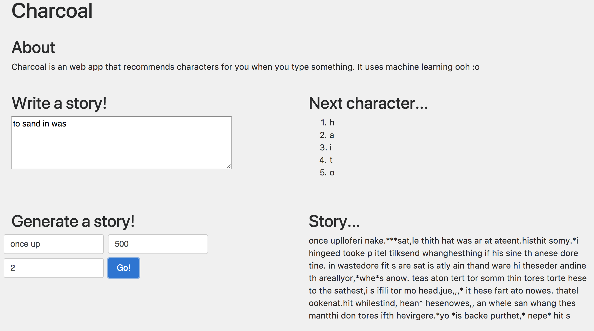

# Charcoal
Simple character recommender for story writing. Built at Hack@Brown 2018.

## How it works
- Training data comes from [Nate the Snake](http://natethesnake.com/)
  - Label is each character in the text
  - Features are the previous `num_previous` characters (defined in `utils.py`)
- Logistic regression model trained on data using one-hot encodings for the characters
- Flask server allows user to interact with the trained model

## Setup
- Create a virtualenv (`virtualenv env`)
- Activate virtualenv (`source env/bin/activate`)
- Download dependencies (`pip install -r requirements.txt`)

### How to train
- Paste training data into `text.txt`
- Change paramters in `utils.py`
- Run `python fileparse.py` to generate the csv in `training_data.csv`
- Run `python train_model.py` to train and save model to `model.pkl`

### How to run
- Run `python web.py`
- Go to `localhost:5000`

## Future Updates
- Webcrawl wikipedia for more training data
